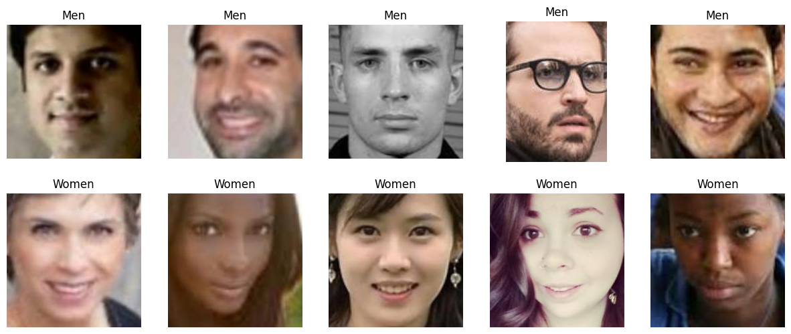

# Gender Classification Using CNN and Transfer Learning(ResNet and VGG16)
This is a gender classification mini project done for my Data Science Lab.
## Dataset Used
UTK dataset, dataset from the base code (the base code's repo is pasted down below), some images from google, and CelebA dataset images for validation

## Neural Networks used
Used the CNN from the base code and transfer learning ResNet and VGG16 from other sources on the internet
## Trained model
The trained models
 
Version 1 model (CNN Model) - https://drive.google.com/drive/folders/13Qmp3hy7MFZ67XAl34bKITM-EWckSK_l?usp=drive_link  
CNN model - https://drive.google.com/drive/folders/1rUkL1QdKiIWa6NkVltYAExe2iWpmpS0n?usp=drive_link  
VGG16 model - https://drive.google.com/drive/folders/1Io1uG6-KoD7_gWAdqR7PjohZoMqiLI-5?usp=drive_link  
ResNet model - https://drive.google.com/drive/folders/11DgBhBTM3HlYYqv7rQL3V-cj6rTWoC3H?usp=drive_link  
## Note
The Version 1 model performs very well in classifying real time images from the webcam but the one that are trained on the new code is not performing that good. I am not sure why. 
For more details refer the documentation.
## Base code link
Gender-detection by Balaji Srinivas - https://github.com/balajisrinivas/Gender-Detection
